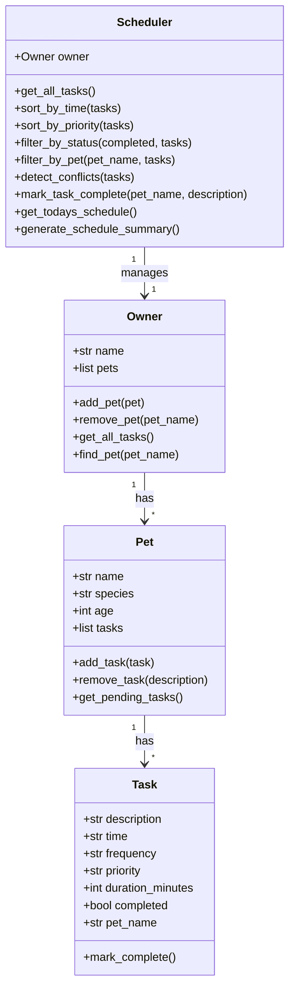

# PawPal+ 🐾

a smart pet care management system that helps pet owners plan and organize daily care tasks for their furry friends.

## Scenario

a busy pet owner needs help staying consistent with pet care. they want an assistant that can:

- track pet care tasks (walks, feeding, meds, enrichment, grooming, etc.)
- consider constraints (time available, priority, owner preferences)
- produce a daily plan and explain why it chose that plan

## Features

- **add pets and tasks** — create pets with their info and assign tasks with time, priority, duration, and frequency
- **sorting by time** — tasks are automatically sorted chronologically so you see your day in order
- **priority sorting** — view tasks ordered by importance (high, medium, low)
- **filtering** — filter tasks by pet name or completion status
- **conflict detection** — get warnings when two tasks overlap at the same time
- **recurring tasks** — daily and weekly tasks automatically regenerate after completion
- **streamlit ui** — clean web interface to manage everything visually

## Smarter Scheduling

the scheduler class acts as the brain of pawpal+. it pulls tasks from all pets, sorts them by time or priority, detects conflicts, and handles recurring task logic. when you mark a daily task as complete, a new instance is created for the next day. the conflict detector warns you if two tasks are booked at the same time across any pets.

## System Architecture

the system uses four main classes:
- **Task** — dataclass representing a single activity with description, time, priority, frequency, and completion status
- **Pet** — holds pet details and a list of tasks
- **Owner** — manages multiple pets and provides access to all tasks
- **Scheduler** — retrieves, sorts, filters, and manages tasks across all pets

### UML Diagram (Mermaid)



## Getting Started

### Setup

```bash
python -m venv .venv
source .venv/bin/activate  # windows: .venv\Scripts\activate
pip install -r requirements.txt
```

### Run the CLI Demo

```bash
python main.py
```

### Run the Streamlit App

```bash
streamlit run app.py
```

## Testing PawPal+

run the full test suite with:

```bash
python -m pytest
```

the tests cover:
- task completion (marking tasks done changes status)
- task addition (adding tasks increases count)
- sorting correctness (tasks returned in chronological order)
- priority sorting (high > medium > low)
- recurrence logic (daily tasks create a new occurrence after completion)
- conflict detection (same-time tasks trigger warnings)
- filtering by pet and status
- edge cases (pet with no tasks, non-recurring tasks don't duplicate)

**confidence level: 4/5 stars** — the core scheduling logic is well tested. edge cases like overlapping time ranges (not just exact matches) would be the next thing to test.
